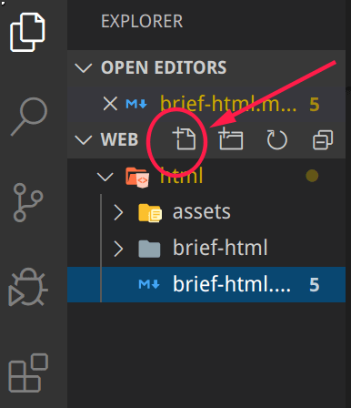

                                                                           **HTML学习总结**

[TOC]

### 1.什么是HTML？

**HTML**是超文本标记语言（HyperText Markup Language）的缩写。我们用 HTML 来构建 Web 页面即所谓的网页。

"超文本"（hypertext）是指连接单个网站内或多个网站间的网页的链接。链接是网络的一个基本方面。只要将内容上传到互联网，并将其与他人创建的页面相链接，你就成为了万维网的积极参与者。

**HTML** 是构成 Web 世界的一砖一瓦。它定义了网页内容的含义和结构。除 HTML 以外的其它技术则通常用来描述一个网页的表现与展示效果（如 CSS），或功能与行为（如 JavaScript）。

**HTML** 不是一门编程语言，而是一种用于**定义内容结构的标记语言**。

在浏览器中看到的任何网页背后都是一个 **HTML** 文档，只要在网页上点击鼠标右键->查看源代码（用控制台工具也可）就可看到。

**HTML**以及我们后面将要学习的 **CSS**（Cascading Style Sheets 级联式样式表) 和 **JavaScript** 是构建广泛使用的Web程序的三剑客。

### 2.HTML怎么用？

利用一些编辑器 如VScode新建一个 **后缀名为html** 的文件，如下图所示：



### 3.HTML 常用知识：

#### 1.HTML元素（elements）

HTML 使用"标记"（markup）来注明文本、图片和其他内容，以便于在浏览器中显示。HTML 标记包含一些规定的"元素"

```
<head>，<title>，<body>，<header>，<footer>，<article>，<section>，<p>，<div>，<span>，，<aside>，<audio>，<canvas>，<datle>，<details>，<embed>，<nav>，<output>，<progress>，<video> 
```


1. 开始标签（Opening tag）：包含元素的名称（本例为 p），被左、右角括号所包围。表示元素从这里开始或者开始起作用 —— 在本例中即段落由此开始。
2. 结束标签（Closing tag）：与开始标签相似，只是其在元素名之前包含了一个斜杠。这表示着元素的结尾 —— 在本例中即段落在此结束。初学者常常会犯忘记包含结束标签的错误，这可能会产生一些奇怪的结果。
3. 内容（Content）：元素的内容，本例中就是所输入的文本本身。
4. 元素（Element）：开始标签、结束标签与内容相结合，便是一个完整的元素。

#### 2.空元素：

元素是可以有相关属性的。属性包含元素的额外信息，这些信息不会在浏览器中显示出来。

```html
<!-- 带属性的段落输入框 -->
<p title="这是个title属性">鼠标移上来试试！</p>
<!-- 带属性的输入框 -->
<input type="text">
<input type="password">
```

一个属性必须包含如下内容：

1. 一个空格，在属性和元素名称之间。(如果已经有一个或多个属性，就与前一个属性之间有一个空格。)
2. 属性名称，后面跟着一个 = 号。
3. 一个属性值，由一对引号 "" 引起来。


HTML 提供了从大到小6级标题，分别是：`<h1> ~ <h6>`，如下所示：

```html
<h1>This is heading 1</h1>
<p>This is some text.</p>
<hr>
<h2>This is heading 2</h2>
<p>This is some other text.</p>
<hr>
```

在页面中，标题非常重要：

1. 搜索引擎用标题来索引页面的内容
2. 用户也习惯以标题进行主要内容浏览，以决定是否查看该页面

#### 3.超链接语法

```html
<a href="https://www.baidu.com/" target="_blank">百度一下</a>
```

说明：

1. `href`即为要跳转去的地址 URL（Uniform Resorce Locator)
2. `target`属性为`_blank`表示在新的页面打开超链接（默认是在当前页面打开即`_self`）
3. 超链接标签包含的内容（当前为文字"百度一下"）即为显示在页面上供用户点击的

#### 4.锚点

锚点，也称为书签，用于标记页面的某个元素或位置。通过锚点，我们可以轻易的在长页面内实现跳转。

先使用`id`属性生成某元素的锚点，然后再使用超链接指向该锚点即可。

```html
<!-- 文档其余部分 -->
<h2 id="C4">第四章 论零号病人的重要性</h2>
<!-- 文档其余部分 -->
<a href="#C4">跳到第四章</a>
<!-- 文档其余部分 -->
...
```

#### 5.图片

在页面插入一张图片如下：

```html

```

说明：

1. `src`属性为要显示图片文件的位置 URL，即图片文件的路径
2. `alt`属性当获取图片出现问题时显示的文字（占位符）
3. 可为图片指定高宽度，但不建议（可能导致图片变形）

#### 6.文件路径

为获取图片文件，我们需要指定该文件位于何处，这称为文件路径。文件路径有相对路径和绝对路径两种。

上面图片的例子即为绝对路径。下面是相对路径的例子：

|                                    |                                        |
| ---------------------------------- | -------------------------------------- |
| 例子                               | 解释                                   |
| ``          | 该图片文件与当前文档在同一目录中       |
| `` | 该图片文件在当前目录下的`images`目录中 |
| ``       | 该图片文件在上一级目录中               |

#### 7.无序列表

```
<ul>
  <li>Coffee</li>
  <li>Tea</li>
  <li>Milk</li>
</ul>
```

无序列表使用`<ul>`标签，默认使用**实心圆点**作为每项的标志，其它的标志可以是空心圆`circle`，实心方块`square`以及不出现标志。

```
<ul type="square">
  <li>Coffee</li>
  <li>Tea</li>
  <li>Milk</li>
</ul>
```

#### 8.有序列表

```html
<ol>
  <li>Coffee</li>
  <li>Tea</li>
  <li>Milk</li>
</ol>
```

有序列表使用`<ol>`标签，默认使用**数字**作为每项的标志，其它的标志可以是大写字母`A`，小写字母`a`，罗马字母`i`等。

```html
<ol type="a">
  <li>Coffee</li>
  <li>Tea</li>
  <li>Milk</li>
</ol>
```


当网站需要获取我们的一些信息如：用户名、密码、选择买什么、买多少、提出意见等等时，我们就需要使用表单（form）来让用户填写或选择。

**提示：** 当提交时，表单中没有`name`属性的元素将不会提交，比如上面工作日期的选择器。有`name`属性的元素其`value`的值将提交给服务器。


HTML 的元素可以以称为**区块** 或 **内联**的方式进行显示。

#### 9.区块元素

区块元素在浏览器显示时，通常会以**新行**来开始（和结束）。如：`<h1>, <pre>, <ul>, <table>，<`div> 等。

```html
<h2>区块元素</h2>
<div>Hello</div>
<div>World</div>
<p>单独一行</p>
```

#### 10.内联元素

内联元素相反，他们总是一个接一个进行显示，不会新起一行。如： `<span>, <input>, <td>, <a>, `等。

```html
<h3>下面的元素将在一行中显示</h3>
<span>姓名：</span>
<input name="username">
<span>哈哈哈</span>
<a href="https://google.com/">Google</a>

```

##### 预设格式

如果你想在网页中展示一首诗或一些特别格式的文本，那么请使用`pre`标签。

```html
<!-- pre标签中的内容将保持格式不变 -->
<pre>
             山不在高，有仙则灵
             水不在深，有龙则灵
</pre>
```

#### 11.特殊字符

考虑下面的代码将显示成什么？

```html
<p>有多          远，滚                         多远！</p>
```

或者你希望在页面显示一段 HTML 的源代码，你打算用标签`<pre>`:

```html
<pre>htm
  <h1>这是个一级标题</h1>
  <p>这是一个段落<p>
  <a href="https://twitter.com/">谦谦君子，温润如玉</a>
<pre>
```

以上代码将得不到你想要的结果。
原因是：在 HTML 中，某些字符是预留的。
在 HTML 中不能使用小于号（<）和大于号（>），这是因为浏览器会误认为它们是标签。
如果希望正确地显示预留字符，我们必须在 HTML 源代码中使用字符实体（character entities）

```
<p>有多&nbsp;&nbsp;&nbsp;远，滚&nbsp;&nbsp;&nbsp;&nbsp;&nbsp;&nbsp;&nbsp;多远！</p>
<hr>
<h2>test.html</h2>
<pre>
  &lt;h1&gt;这是个一级标题&lt;/h1&gt;
  &lt;p&gt;这是一个段落&lt;p&gt;
  &lt;a href="https://twitter.com/"&gt;眼见何事，情系何处，身处何方，心思何人&lt;/a&gt;
<pre>
```